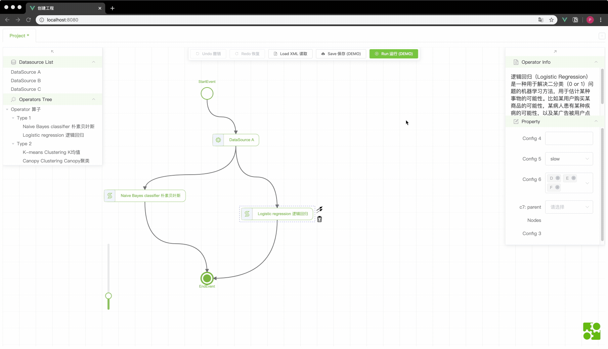
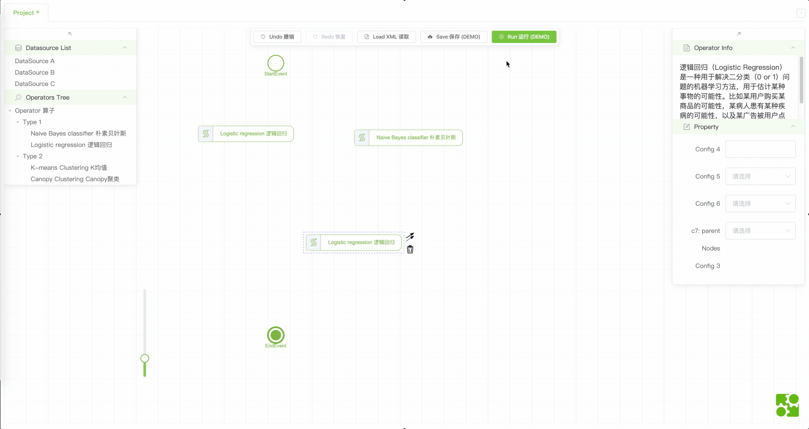
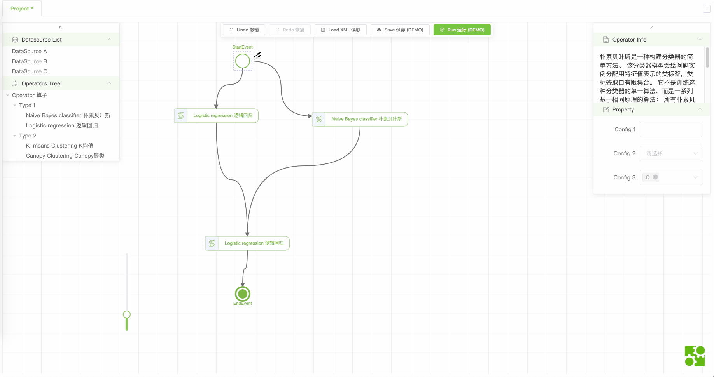

# BPMN 数据流图编辑器

其它语言：[English](README.md)

本项目是一个集成流程编辑器的例子。它基于定制的 bpmn-js 和 Vue.js 开发。你需要知道 Vue.js 的知识来阅读和理解源代码。

## 功能

- 可视化编辑：使用简单的点击、拖拽、放置编辑数据流图。 
- 保存和读取 XML：保存/读取图和节点信息。 
- 属性和数据转移：可扩展的节点属性编辑面板，且数据可以在节点间流动。 
- 动画效果：为节点展示任意的 CSS 样式动画。 (**旧版**实现) 
- 无级缩放：流畅放大和缩小 (比[原版的逐级缩放](http://demo.bpmn.io/)更加平滑) 
- 多图操作：同时打开和编辑多个图。 

## 开始

```sh
git clone https://github.com/Pingren/BPMNFlowEditor
cd BPMNFlowEditor
yarn & yarn serve
```

## 设计

### 项目结构

- [`components`]
  - [`PanelLeft`]
    - [`index.vue`] Panel 包含 Pane
    - [`PaneDatabase.vue`] list style node picker
    - [`PaneOperator.vue`] tree style node picker
  - [`PanelRight`]
    - [`index.vue`] Panel 包含 Pane
    - [`PaneNodeInfo.vue`] 节点信息预览
    - [`PaneProperty.vue`] 可扩展的节点属性编辑面板
  - [`PanelTop`]
    - [`index.vue`] Panel 包含编辑、保存等功能的按钮
  - [`DiagramEditor.vue`] 包含了所有的 vue 组件，负责在其生命周期内创建 diagram 对象和 vuex 状态
  - [`ZoomSlider.vue`] 缩放滑块
- [`module`]
  - [`xxx.js...`] 自定义 bpmn.js 模块，自定义的内容注释在文件中
  - [`index.js`] 自定义 bpmn.js 模块帮助文件，禁用了部分模块
- [`store`]
  - [`module.js`] vuex 重用模块
  - [`index.js`] vuex 根状态，控制模块动态注册
- [`App.vue`] app 入口，包含了 el-tabs，每个 tab 拥有一个 DiagramEditor
- [`Diagram.js`] Diagram 类
- [`mock.js`] 模拟后端返回的数据

### 解释说明

#### Diagram.js

`Diagram` 是表示数据流图的类。它在 constructor 里创建了 bpmn-js 相关对象并且将它们绑定到实例上。它提供了 `importXML` 和 `exportXML` 方法，以及其它图操作方法（比如 `createNode`）。

当一个 tab，即 `DiagramEditor` 组件 **mounted** 时，它会创建一个 diagram 对象。接着它会将其用 [provided/injected API](https://cn.vuejs.org/v2/api/index.html#provide-inject) 注入到其所有子组件中。如此一来，所有的 vue 子组件都可以使用 diagram 对象来控制图。

Diagram 也有一些“私有”方法：`evaluateNodeData`、`evaluateNodeInput`、`evaluateNodeOutput` 等等。 它们在 bpmn-js EventBus 回调中调用，不应该被外部使用。

#### Vuex 状态

一些流程图的状态应该是响应式的，所以需要使用 [vuex](https://vuex.vuejs.org/zh/)。每个 diagram 对象都伴随着一个 vuex 状态 store，并使用一个 key 跟踪它。

因为可能有多个 tab 和多个图，本项目 [重用了相同的 vuex 模块](https://vuex.vuejs.org/zh/guide/modules.html#module-reuse)。当一个 tab，即 `DiagramEditor` 组件 **created** 时，vuex 模块将被[注册](https://vuex.vuejs.org/zh/guide/modules.html#dynamic-module-registration)，并在组件销毁前卸载。

vuex 模块包含了流程图的基本状态比如 currentNodeId、isRunning 等等。它也包含了三个节点数据模型对象：inputModel、transferModel、outputModel。

#### 节点数据模型

每个节点有着它的属性，保存在 transferModel 中。用户可以在节点属性编辑面板中改变属性。

一个节点还可以有输入和输出数据，保存在 inputModel 和 outputModel 中。输入和输出数据由节点属性，图的拓扑结构以及节点的输入输出的配置共同决定：

- 节点输入配置：决定了一个节点如何使用其所有父节点的输出(outputModel) 生成该节点的输入。

- 节点输出配置：决定了一个节点如何使用其属性(transferModel) 生成该节点的输出。

inputModel 和 outputModel 都将自动更新。 核心逻辑在 Diagram.js 之中，使用广度优先遍历。

## 项目依赖

- [bpmn-js](https://github.com/bpmn-io/bpmn-js) - 本项目的主要依赖。
- [bpmn-js-cli](https://github.com/bpmn-io/bpmn-js-cli) - 使开发调试更容易的帮助库。
- [vue](https://vuejs.org) - 一个搭建用户界面的渐进式框架。
- [element-ui](https://element.eleme.io) - 广泛使用的 UI 库。

## 杂项

### 相关项目和产品

以下是一些使用类似数据流图编辑器的工程和项目：

- [AI-Blocks](https://github.com/MrNothing/AI-Blocks)

- [腾讯 Oceanus-ML](https://data.qq.com/article?id=3921)

- [Azure Machine Learing designer](https://docs.microsoft.com/en-us/azure/machine-learning/concept-designer)

- [Salesforce Dataflow Editor](https://help.salesforce.com/articleView?id=bi_integrate_dataflow_configure_editor.htm)

### 旧版本

  代码曾经重构并且有了很大的变化，你可以在分支 `archive-codebase` 上查看旧版本。请**注意**它的设计和结构与现在的主分支**大相径庭**。

### 问题

暂时没有，欢迎问题和建议！
